# List of all Mob Heads

### Allay

### Black Sheep

### Blaze

### Blue Sheep

### Blue Wither Projectile

### Brown Sheep

### Camel

### Cave Spider

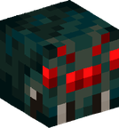

### Charged Creeper

### Chicken

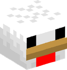

### Cod

### Cold Strider

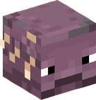

### Cow

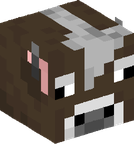

### Cyan Sheep

### Dolphin

### Donkey

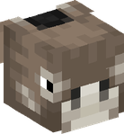

### Drowned

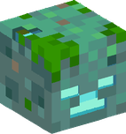

### Elder Guardian

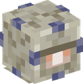

### Enderman

### Endermite

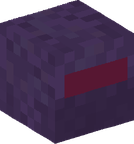

### Evoker

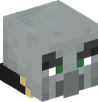

### Ghast

### Glow Squid

### Gray Sheep

### Green Sheep

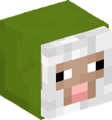

### Guardian

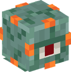

### Hoglin

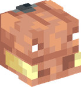

### Husk

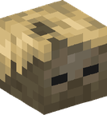

### Illusioner

### Iron Golem

### jeb_ Sheep

### Light Blue Sheep

### Light Gray Sheep

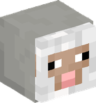

### Lime Sheep

### Magenta Sheep

### Magma Cube

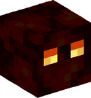

### Mule

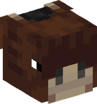

### Ocelot

### Orange Sheep

### Phantom

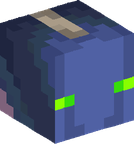

### Pig

### Piglin Brute

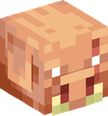

### Pillager

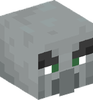

### Pink Sheep

### Polar Bear

### Pufferfish

### Purple Sheep

### Ravager

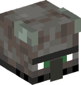

### Red Sheep

### Salmon

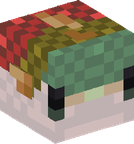

### Silverfish

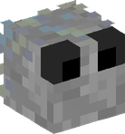

### Skeleton Horse

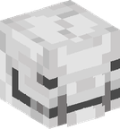

### Slime

### Sniffer

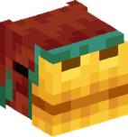

### Snow Golem

### Spider

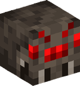

### Squid

### Stray

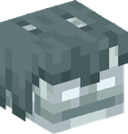

### Strider

### Tadpole

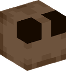

### Tropical Fish

### Turtle

### Vex

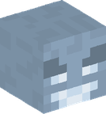

### Vex

### Vindicator

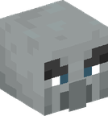

### Wandering Trader

### Warden

### White Sheep

### Witch

### Wither

### Wither Projectile

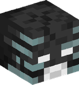

### Yellow Sheep

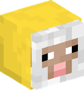

### Zoglin

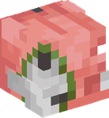

### Zombie Horse

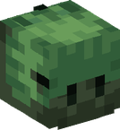

### Zombified Piglin

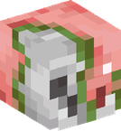

